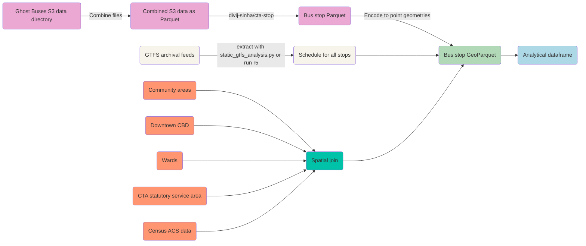

# Measuring CTA bus service
 

## Background

The goal for this project is to inform reporting on the quality of bus service across Chicago's neighborhoods over time in a way that is intuitive and captures the lived reality of people who regularly rely on the CTA. The ideal analysis will measure service quality at the bus-stop level and report the number of buses that pass within a 5 minute time frame as well as the amount of time that passed between each bus. 

The research should incorporate analytics for different time windows (weekdays, weekends, rush hour, month, day of week, month, season, year) and geographic groupings such as community area, ward, Census tract / block group, citywide, and groupings based on demographics (i.e, plurality race / ethnicity, median household income buckets, fraction of residents who commute to work on public transit). 

### Potential research questions
* How does bus service vary across community areas, demographic groupings, and socioeconomic levels? Do more well-off neighborhoods get better service? Are neighborhoods most reliant on the CTA most likely to get lower quality service (use Census ACS commuter data)?
* Has service improved or worsened in different parts of the city? What is the most reliable and least reliable area for CTA service? When CTA is needed most (during rush hour), does it deliver?
* How does actual service compare to the scheduled level of service available in the GTFS? Have service cuts (reflected in newer versions of the GTFS) created the appearance of improved performance? Where does the CTA over or under-perform relative to the scheduled times?
* Some other questions:
	* What is the effect of dedicated bus lanes on CTA bus reliability? 
	* Is there a relationship between bus service quality and ridership level? How well does supply of buses align with demand in terms of [daily route ridership](https://data.cityofchicago.org/Transportation/CTA-Ridership-Bus-Routes-Daily-Totals-by-Route/jyb9-n7fm/about_data)?
	* Are traffic conditions to blame for suboptimal CTA performance? 
	* How realistic are the CTA schedules (are time estimates in the GTFS too optimistic)?
	* How significant is bus bunching as a source of delays?
 	* Does [Uber and Lyft traffic](https://data.cityofchicago.org/Transportation/Transportation-Network-Providers-Trips-2023-/n26f-ihde/about_data) correlate with slower bus times?
  	* Some research shows that CTA has shorter [bus stop spacing](https://findingspress.org/article/27373-distributions-of-bus-stop-spacings-in-the-united-states) compared to most other cities. Does the shorter distance between bus stops correlate with reduced bus service quality?
	
## Methodology and data overview

### CTA bus data engineering
* **Download all data from Ghost Buses S3 bucket:** Daily snapshots of the CTA vehicles feed are available from S3 from 2022-05-20 to current. Please refer to the [ChiHackNight Ghost Buses repo](https://github.com/chihacknight/chn-ghost-buses/blob/main/data_analysis/README.md#accessing-data-in-s3) for more information about accessing the files. When developing the workflow be sure to make the process repeatable since future collaborators may want to periodically run the pipeline to update the analysis with more recent data. To combine and store the daily snapshots use Python `polars` [scan_csv()](https://docs.pola.rs/py-polars/html/reference/api/polars.scan_csv.html) and [sink_parquet](https://docs.pola.rs/py-polars/html/reference/api/polars.LazyFrame.sink_parquet.html) operations to write the files. The original source of the S3 is the [CTA Bus Tracker API feed](https://www.transitchicago.com/developers/bustracker/).
* **Transform S3 data from vehicle position level to the bus stop level:** @divij-sinha is currently developing a process to convert the raw S3 data to a more analysis-ready format in the repo [divij-sinha/cta-stop](https://github.com/divij-sinha/cta-stop). This process involves transforming the raw S3 data which represents 5 minute snapshots of every bus in the CTA system to a target format that will consist of one row for every time a bus passes a bus stop with columns representing the time since the last bus passed. So for instance, if two buses pass a stop within a 5 minute snapshot, there will be two rows, each listing the estimated time the first bus passed and the estimated time since the last bus. There are several reasons why this transformation is necessary, namely it will allow us to report wait times and number of buses per 5 minutes. Performance metrics derived from this format will be easier for the layperson to understand and easier to localize than bus positions.

### GTFS data engineering
* **Compile archival GTFS feeds:** A General Transit Feed Specification (GTFS) is an open data standard used to distribute relevant information about transit systems. GTFS feeds contain information about routes, schedules, fares, and geographic transit details, and it is presented in simple text files. When CTA changes their schedule,they push updates to the GTFS feed so its important to incorporate these changes when comparing GTFS data with the real time CTA API data. There are a number of sources for GTFS data, including: [official CTA developer page](https://www.transitchicago.com/developers/gtfs/) / [CTA FTP](https://www.transitchicago.com/downloads/sch_data/),  [Transit Land](https://www.transit.land/feeds/f-dp3-cta#versions) archive, [Mobility Database](https://mobilitydatabase.org/), [Transit Feeds](https://transitfeeds.com/p/chicago-transit-authority/165) archive. Review these sources and compile all available feeds for the CTA since 2022-05-20. An alternative to GTFS data that may be useful is available via the CTA Bus Tracker APIs [getpatterns](https://www.transitchicago.com/assets/1/6/cta_Bus_Tracker_API_Developer_Guide_and_Documentation_20160929.pdf#page=20) request which returns geo-positional points and stops that when connected can be used to construct the geo-positional layout of a pattern for each route. However these patterns only represent the current snapshot of routes.
* **Develop benchmarks based on GTFS schedules:** The CTA data provides estimates of actual bus times and number of trips. However, it may be useful to compare the actual times to the official expected times in the CTA schedule via the published GTFS feed. To compare performance to these time benchmarks it is necessary to process the GTFS data. There are two options. First, there is a chihacknight repo with a script [static_gtfs_analysis.py](https://github.com/chihacknight/chn-ghost-buses/blob/main/data_analysis/static_gtfs_analysis.py) to calculate the scheduled number of current active trips given a date, time, and route. The second option is more advanced and uses the R⁵ (Rapid Realistic Routing on Real-world and Reimagined networks) routing engine to build detailed itineraries or travel time matrices between any set of origin and destination points following the GTFS feed parameters. There is an R wrapper for r5 called [r5r](https://ipeagit.github.io/r5r/) and a Python wrapper called [r5py](https://r5py.readthedocs.io/en/stable/).

### Analysis and reporting
* **Create time interval columns:** Once the analytical tables are ready add categorical time windows to group the data for different reporting periods and to enable time series analysis. These might consist of weekdays, weekends, rush hour, month, day of week, month, season, year.

* **Spatially join geographic boundaries:** As part of the analysis it is necessary to add different geographic units for reporting aggregate measures. This requires downloading spatial boundaries from various sources such as the Chicago Data Portal or the Census, and using R [sf](https://r-spatial.github.io/sf/) or Python [geopandas](https://geopandas.org/en/stable/) to spatially join the files to the bus stop or vehicle positions by encoding those latitudes and longitudes as point geometries. Here are links to relevant spatial boundaries to incorporate into the analysis: [community areas](https://data.cityofchicago.org/Facilities-Geographic-Boundaries/Boundaries-Community-Areas-current-/cauq-8yn6), [downtown CBD](https://data.cityofchicago.org/Facilities-Geographic-Boundaries/Boundaries-Central-Business-District/tksj-nvsw), [wards](https://data.cityofchicago.org/Facilities-Geographic-Boundaries/Boundaries-Wards-2023-Map/cdf7-bgn3), [ward-precincts](https://data.cityofchicago.org/Facilities-Geographic-Boundaries/Boundaries-Ward-Precincts-2023-/6piy-vbxa/about_data), [CTA statutory service area](https://data.cityofchicago.org/Facilities-Geographic-Boundaries/CTA-Statutory-Service-Area/duu3-nb8k). 

* **Join Census ACS data:** The [tidycensus R package](https://walker-data.com/tidycensus/index.html) is a relatively easy way to retrieve ACS data for 'block group' or 'tract' geometries in Cook County. After downloading the data, construct labels for each 'block group' or 'tract' for concepts like plurality race; majority Black, Latino, white, Asian, or other; buckets for different median household income levels, and a categorical grouping for what proportion of the tract's commuter population relies on public transit. Below is code snippet for downloading 'block group' spatial boundaries and population, median household income, housing value, housing cost, owner-occupancy, fraction of residents that use public transit, and race / ethnicity. A more extensive example of downloading and processing Census data then joining it to community areas is available in [this script](https://github.com/mansueto-institute/housing-transit-patterns/blob/main/iso-dev-viz.R).
	```
	library(tidyverse)
	library(tidycensus)
	# List of ACS relevant data series
	data_series <- c('B01003_001', 'B25001_001', 'B25071_001', 'B25077_001', 'B19013_001', 'B25106_001', 'B25106_002', 'B25106_024', 'B03002_003', 'B03002_004', 'B03002_005', 'B03002_006', 'B03002_007', 'B03002_008', 'B03002_009', 'B03002_012', 'B08301_001', 'B08301_010', 'B08301_011')
	# Data dictionary
	census_data_dict <- load_variables(year = 2022, dataset = c('acs5'), cache = FALSE)
	# Download data
	data <- get_acs(year = 2022, geography = "block group", survey = 'acs5', variables = data_series, cache_table = TRUE, state = '17', county = '031', geometry = FALSE)
	# Download boundaries
	boundaries <- get_acs(year = 2022, geography = "block group", survey = 'acs5', variables = 'B01003_001', cache_table = TRUE, state = '17', county = '031', geometry = TRUE)
	```

## Workflow diagram


## Caveats and disclaimers

#### **Ghost Buses background:** 
[Project website](https://ghostbuses.com/methods) and background on methods, the [repo](https://github.com/chihacknight/chn-ghost-buses), and see this [Git Issue](https://github.com/chihacknight/breakout-groups/issues/217) about the state of development on the project. ChiHackNight presentations on Jan 16, 2024  and on Nov 13, 2022. 
#### **Caveats from the developers of Ghost Buses:**
* Universe of routes was last updated in Spring 2022 so new route IDs might not be in the data.
* Data for the 74 Fullerton route is unreliable and should be dropped.
* Recommend dropping data for days when the schedule changes (so the day a new GTFS feed is switched over).
* Because the data is based on GPS devices, which can fail or break, consider adding data checks to exclude unrealistic results that do not comport with expectations.
* Develop automated checks to reconcile that all bus IDs are accounted for, for instance,  the trip ID was missing for a small number of trips on the 66 Chicago Bus. This was only listed as a series of asterisks like ********. 
#### **CTA 'L' data:**
A separate project that tracks the CTA ‘L’ data is from Brian McFadden. Here is his [API](https://brandonmcfadden.com/transit-api) and [dashboard](https://brandonmcfadden.com/cta-reliability). 

## Prior articles
* [CTA FOIA Archive](https://github.com/nikhunder/CTA-FOIA) and [more FOIA data here](https://www.moomers.org/foia/)
* [CTA said more train service would be coming. Most riders will have to wait longer for that to happen.](https://web.archive.org/web/20240410014605/https://www.chicagotribune.com/2024/04/08/cta-new-train-schedules/)
* [After pandemic cuts, CTA will start running more buses on some routes](https://web.archive.org/web/20240410171716/https://www.chicagotribune.com/2024/03/20/cta-bus-service/)
* [CTA unveils $2 billion budget that aims to draw back riders, address employee shortages](https://web.archive.org/web/20240307171109/https://www.chicagotribune.com/2023/10/19/cta-unveils-2-billion-budget-that-aims-to-draw-back-riders-address-employee-shortages/)
* [CTA Brown, Orange Line schedules down more than 25%, even as other cities rebuild transit levels](https://web.archive.org/web/20240410171656/https://www.chicagotribune.com/2023/10/10/cta-brown-orange-line-schedules-down-more-than-25-even-as-other-cities-rebuild-transit-levels/)
* [Unreliable CTA service is a frustration for riders. It’s also costing Chicago.](https://web.archive.org/web/20240307172959/https://www.chicagotribune.com/2023/04/24/unreliable-cta-service-is-a-frustration-for-riders-its-also-costing-chicago/)
